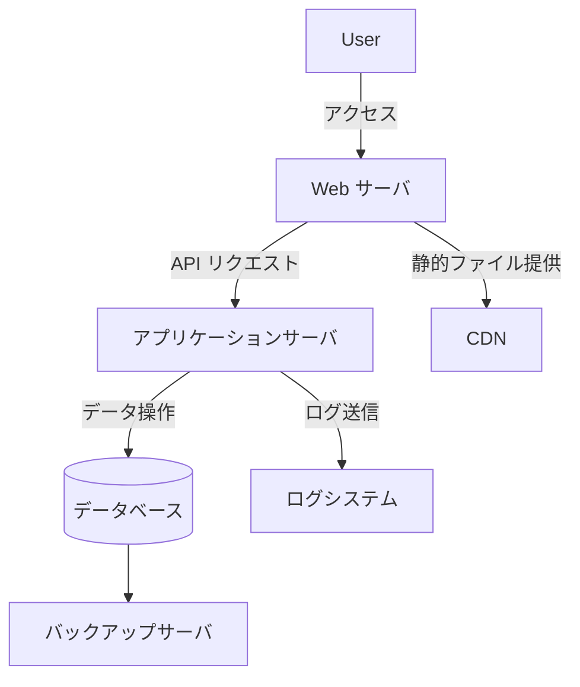

# tmp-hoge



```mermaid
graph TB
    subgraph VPC["VPC"]
        subgraph PublicSubnet["Public Subnet"]
            IGW[Internet Gateway]
            ALB[Application Load Balancer]
            EC2_1[EC2 Instance 1 (Web Server)]
            EC2_2[EC2 Instance 2 (Web Server)]
        end

        subgraph PrivateSubnet["Private Subnet"]
            ASG[Auto Scaling Group]
            EC2_App[EC2 Instance (App Server)]
            RDS[(RDS Instance)]
        end

        subgraph IsolatedSubnet["Isolated Subnet"]
            Redis[Elasticache (Redis)]
            S3[S3 Bucket (Backup)]
        end
    end

    subgraph External["External Services"]
        CloudFront[CloudFront Distribution]
        S3_Static[S3 Bucket (Static Assets)]
        Route53[Route 53 (DNS)]
    end

    subgraph Security["Security Components"]
        WAF[Web Application Firewall]
        SG_Web[Security Group (Web)]
        SG_App[Security Group (App)]
        SG_RDS[Security Group (RDS)]
    end

    %% Connections
    CloudFront --> Route53
    CloudFront --> WAF
    WAF --> ALB
    ALB --> EC2_1
    ALB --> EC2_2
    ALB --> SG_Web
    EC2_1 --> SG_Web
    EC2_2 --> SG_Web

    EC2_1 --> ASG
    EC2_2 --> ASG
    ASG --> EC2_App
    EC2_App --> RDS
    EC2_App --> SG_App
    RDS --> SG_RDS
    SG_RDS --> SG_App
    SG_App --> Redis

    Redis --> S3
    S3 --> S3_Static
    S3_Static --> CloudFront
    IGW --> ALB
```
